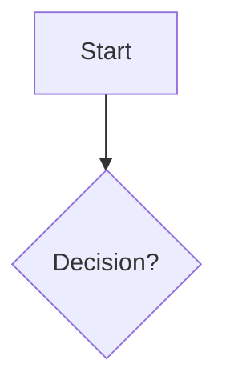

# Design Document Standards

## Purpose

Design documents provide the technical blueprint for implementing requirements. They should be comprehensive, well-organized, and easy to navigate.

## Structure

### Table of Contents
Place after Overview.
```markdown
## Table of Contents
- [Overview](#overview)
- [Architecture](#architecture)
- [Components and Interfaces](#components-and-interfaces)
- [Data Models](#data-models)
...
```

### Visual Diagrams
Use **Mermaid** when a diagram clarifies the design and the target renderer supports it. A diagram is optional when prose or a small table is clearer.
- **Flowcharts**: Process flows.
- **Sequence Diagrams**: Component interactions.
- **Class Diagrams**: Data models.



### External References
Create a section for tools, libraries, and specs.

```markdown
## External References
### Tools and Libraries
- Include tools, libraries, standards, and sources that are relevant to the proposed design; do not add a generic tool list.
```

## Content Guidelines

### Tables
Use tables for structured info (inputs, outputs, config).

### Code Examples
Include examples for config files, API usage, and data structures. Specify the language.

### Components
For each component, define:
- **Purpose**
- **Inputs/Outputs**
- **Responsibilities**
- **Interactions**

## Best Practices

- **Context-First**: Inspect the available source code, project documentation, conventions, and existing interfaces before proposing a design. Use a project-knowledge tool only if the environment provides one.
- **Contract-First**: Describe the interface or contract in the design when it is relevant, including inputs, outputs, ownership, and failure behavior. A design task does not by itself authorize creating implementation files such as `types.ts` or `interfaces.go`; implement them only when implementation is in scope.
- **Clarity**: Be precise about how the system works.
- **Traceability**: Reference which requirements are satisfied by which design element.
- **Completeness**: Cover error handling, validation, security, and performance.
